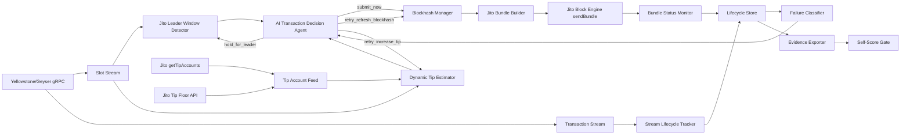
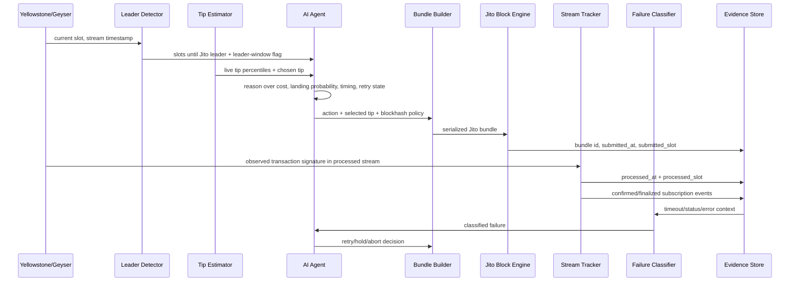

# AgentArena Smart Transaction Stack — Public Architecture Document

> Publish this document as a public Notion, Google Doc, Figma page, or static webpage. Add that URL to `PUBLIC_ARCHITECTURE_URL` before final scoring.

## Executive Summary

AgentArena's smart transaction stack is a production Solana execution layer for autonomous trading and prediction agents. It observes the chain through Yellowstone/Geyser streams, detects Jito leader windows, lets an AI operational agent decide whether to submit, hold, reprice, refresh blockhash, retry, or abort, constructs Jito bundles with dynamic tips, and records judge-verifiable lifecycle evidence from submitted through finalized.

The design intentionally exceeds the minimum challenge requirement: instead of producing only 10 bundle logs and 2 failure cases, the first-place run targets 25 bundle records and 5 controlled failures with visible AI reasoning traces.

## One-Line Architecture

```text
Yellowstone/Geyser → Slot/Tx Streams → Jito Leader Window → AI Tip/Timing/Retry Agent → Dynamic Tip Estimator → Jito Bundle Builder → Jito Block Engine → Stream Lifecycle Tracker → Failure Classifier → Evidence + Autonomous Retry
```

## System Architecture Diagram



## Data Flow



## Key Components

### 1. Yellowstone/Geyser Stream Layer

Files:

```text
src/geyser/yellowstone-client.ts
src/geyser/reconnecting-stream.ts
src/geyser/slot-stream.ts
src/geyser/transaction-stream.ts
```

Responsibilities:

- Subscribe to live slots (with processed/confirmed/finalized status) and transactions.
- Maintain current, confirmed, and finalized slots from stream data.
- Watch submitted signatures for processed landing.
- Drive commitment confirmation from the slot-status stream (`src/core/commitment-tracker.ts`).
- Reconnect automatically with ping and backpressure controls.
- Never rely on RPC polling for landing confirmation (an RPC signature *subscription* is only a fallback).

### 2. Jito Bundle Layer

Files:

```text
src/jito/jito-bundle-client.ts      (transport-agnostic interface)
src/jito/jito-jsonrpc-client.ts     (JSON-RPC transport, default — no searcher auth required)
src/jito/jito-grpc-client.ts        (official jito-ts searcher SDK — for Jito-approved searchers)
src/jito/jito-client-factory.ts
src/jito/bundle-builder.ts
src/jito/tip-account-feed.ts
src/jito/dynamic-tip-estimator.ts
src/jito/leader-window-detector.ts
```

Responsibilities:

- Discover live Jito tip accounts.
- Fetch live tip-floor data.
- Detect the next scheduled Jito leader (`getNextScheduledLeader`).
- Build versioned transactions with a Jito tip transfer.
- Submit bundles via JSON-RPC by default (lands on the public endpoint with no searcher auth), with
  the official **jito-ts** searcher client (`sendBundle` + `onBundleResult`) selectable by
  `JITO_TRANSPORT=grpc` for Jito-approved searchers.
- Subscribe to real-time bundle results (`onBundleResult`) and fall back to inflight/final status.

The orchestrator depends only on the `JitoBundleClient` interface, so the transport can be switched
with one environment variable without touching execution logic.

### 3. AI Operational Agent

Files:

```text
src/agents/tip-intelligence-agent.ts
src/agents/submission-timing-agent.ts
src/agents/retry-reasoning-agent.ts
src/agents/transaction-decision-agent.ts
```

The AI agent owns one real operational decision per attempt — the action and the tip — and the
bounty's required fault path (autonomous retry after blockhash expiry) is driven by its reasoning,
not hardcoded logic.

When `AI_DECISION_MODE=llm`, an Anthropic Claude model is the decision engine. It receives a
structured snapshot of live signals and returns, through a forced tool-call schema:

- the `action` (submit / hold / retry-refresh-blockhash / retry-increase-tip / retry-same-tip / abort),
- the `tipLamports`,
- a `landingProbability`, and
- natural-language `reasoning` that is stored verbatim in every lifecycle record (visible reasoning).

Three deterministic providers supply the model with evidence (they no longer make the final call):

| Signal provider | What it analyzes |
|---|---|
| Tip intelligence | Live tip percentiles, congestion, and leader urgency. |
| Submission timing | Leader-window position and landing probability. |
| Retry reasoning | The prior failure class and retry budget. |

Deterministic **guardrails** then bound the model: the tip is clamped to the configured range, the
retry budget is enforced, and the action is kept coherent with attempt state. `guardrailAdjusted`
records whenever the model's raw output was bounded. Each record stores the `promptHash` of the exact
prompt, the model id, and the LLM latency. If the LLM is unavailable, the agent degrades to a
transparent heuristic engine (`engine: heuristic`) so a run is never blocked. This is not a sequential
wrapper — the agent's reasoning changes real execution behavior.

### 4. Failure Handling Strategy

Files:

```text
src/core/failure-classifier.ts
src/core/fault-injection.ts
src/core/orchestrator.ts
```

Failure classes:

```text
expired_blockhash
fee_too_low
compute_exceeded
bundle_failure
leader_skipped_or_bundle_not_forwarded
confirmation_timeout
simulation_failed
stream_disconnected
unknown
```

Behavior:

- Expired blockhash → AI can refresh blockhash and retry.
- Fee too low → AI can reprice using fresh live tip data and retry.
- Compute exceeded → the payload is invalid, so the AI does not retry it as-is. The fault-injection
  run deliberately forces this class to demonstrate detection: the transaction lands in a block but
  reverts with `ComputationalBudgetExceeded`, and is classified `compute_exceeded` (not a success).
- Leader skip/not forwarded → AI can hold for next favorable leader window.
- Stream disconnect → AI can hold until observability recovers.

### 5. Lifecycle Evidence Layer

Files:

```text
src/core/lifecycle-stream-tracker.ts
src/core/lifecycle-store.ts
src/cli/export-evidence.ts
src/cli/verify-evidence.ts
src/quality/evidence-policy.ts
```

Each record contains:

```text
runId
attemptId
bundleId
signatures
submitted_at / processed_at / confirmed_at / finalized_at
submitted_slot / processed_slot / confirmed_slot / finalized_slot
latency deltas
tip lamports
tip account
leader-window snapshot
AI decision trace
failure classification
explorer links
raw Jito status / live tip percentiles
```

## Infrastructure Decisions

| Decision | Why it matters |
|---|---|
| SolInfra RPC + Yellowstone (sponsor) | The live infrastructure the stack runs on; low-latency stream observations without polling. |
| Dual Jito transport (JSON-RPC default + jito-ts gRPC) | JSON-RPC lands bundles on the public endpoint with no searcher auth (used for the evidence run); the official jito-ts searcher SDK (native submission + `onBundleResult` streaming) is selectable for Jito-approved searchers — both behind one interface. |
| Yellowstone slot-status commitment | Confirmed/finalized are observed from the stream, not RPC polling, matching the challenge requirement. |
| Dynamic tip estimator | Avoids hardcoded tips and adapts to live tip floors and network conditions. |
| LLM agent + deterministic guardrails | The model owns the decision with visible reasoning; guardrails bound tips and retries for safety. No AI vendor is a bounty sponsor, so the LLM rivals nothing. |
| Separate AI layer | Makes the operational decision-maker auditable and replaceable (vendor-agnostic provider interface). |
| Evidence-first design | Judges can cross-check signatures, slots, timestamps, and failure classes. |
| Fault injection | Demonstrates failure handling under controlled adverse conditions (blockhash expiry is the mandated showcase). |
| First-place score gate | Prevents submitting a technically incomplete or evidence-poor run. |

## First-Place Evidence Target

Minimum requirement:

```text
10 bundle submissions
2 failure cases
```

This implementation targets:

```text
25 bundle lifecycle records
5 controlled failure cases
3 AI decision families
dynamic tips from live data
public architecture URL
no dry-run evidence
p50/p90 latency summaries
explorer-verifiable signatures
```

## Operational Runbook

```bash
npm run challenge:doctor
npm run watch:slots
npm run challenge:first-place
```

If the first-place score is below the configured gate, the submission should not be sent yet. Fix the failed diagnostics, rerun live evidence, and export again.
